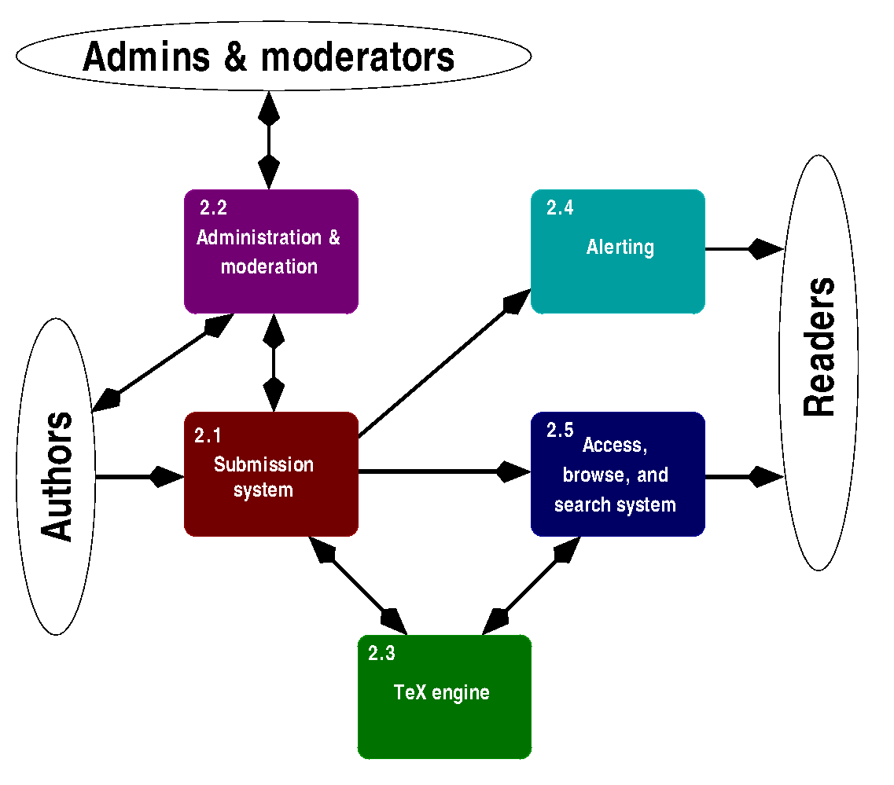
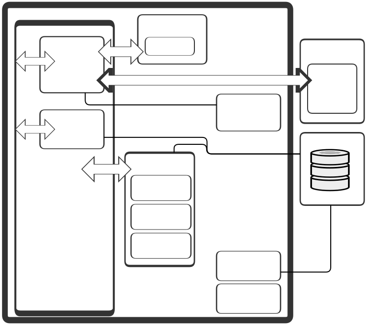

# arXiv Legacy System

This page describes the state of arXiv as it has generally been from 2010 through the start of 2023.

## Software components

The major software components of arXiv are illustrated in the simplified schematic below and described in the following sections.

### Browse, Search, Download

The vast majority of arXiv users are "read-only". THey view abstracts, download articles, and search for articles. The use of arXiv's own search has been descreasing over time, as more users now seem to access articles found through sources like Google Scholar than arXiv's native search (by a small plurality). But that's not really relevant in terms of examining arXiv's own implementation structure, as there's no direct tie-in with the outside search facilities.

Most (all?) of the read-only portion of arXiv is modern, in the sense that Python is the implmentation language, as opposed to the Perl (and some PHP) implementations of the older parts of arXiv. The UI pages are bult using the [Python Flask micro-framework](https://flask.palletsprojects.com/).

#### Home Page

The arXiv "home page" --  lists all the categories that arXiv presently supports, a search box, and little else aside from links to more information about arXiv in the headers and footers.

    

### Submisson system

The arXiv submission system accepts uploads from individual arXiv users (along with metadata, classification information, and license data) and arranges it for moderation and publication. The system is designed so that without intervention from either admins or moderators, all submissions made before a certain freeze time (currently 2pm Mon–Fri) will be made public at the next publication time (currently 8pm Sun–Thu, i.e. a 6h gap between freeze and publish except Fri to Sun). The submission system was rewritten in 2010 using the Perl/Catalyst framework.

In addition to the submission interface for users, there is a machine interface that implements the SWORD protocol (v1.3 with arXiv customizations). The SWORD interface is intended to facilitate bulk upload of conference proceedings, remote submission sites (notably CCSD, see https://hal.archives-ouvertes.fr/page/transfert-vers-arxiv), journal migrations, etc., via registered and trusted proxy submitters. The interface is documented in the public manual at http://arxiv.org/help/submit_sword, that also includes example code to use the interface.

### Administration and moderation

The arXiv system has special user interfaces for moderators and administrators. (If you're not familiar with arXiv's moderation, see https://info.arxiv.org/help/moderation/index.html) for background). There are actually three generations 

## Hardware infrastructure

Since the LANL preprint archive moved to Cornell in 2001 and became arxiv.org, nearly all arXiv services have been hosted in infrastructure owned and managed by the Cornell Information Technology (CIT) organiziation.

Below is an aproximate diagram of the arXiv server farm, circa 2017. The general shape today, at the start of 2023 is about the same, but some servers, like web1, web2, web3, web4, have been retired (because the OSes they were running went out of support), and have been replaced by a new set of web servers like web7, web8, web9, and web10.

Note the the servers starting "CUL" and "CIT" belong to CIT and perform the listed services on behalf of all CIT customers, not just arXiv. CIT runs a fairly large hosting infrastructure for a University. arXiv may be one of CIT's largest "customers", but constitutes only a few percent (by count) of the servers that CIT runs.

## Server configuruations

Configuration of each web node:

